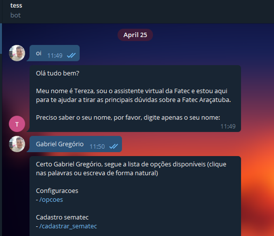
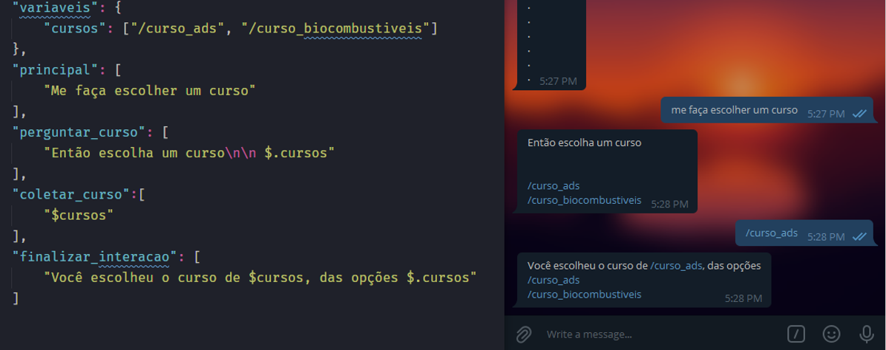

# Tereza Chatbot Experimental   
> Documentação em desenvolvimento   

   
O chatbot tereza é um sistema desenvolvido usando a linguagem Python, o conceito dele é permitir que as interações sejam montadas de acordo com um conceito chamado de extensões. As extensões neste projeto são arquivos próprios e independentes que podem usar de todos os recursos da linguagem Python.

Cada extensão precisa seguir uma padronização para que o sistema a reconheça como legitima. Após esse reconhecimento, uma classe será instanciada e inicializada de cada extensão.

As extensões precisam fornecer informações que serão explicadas mais adiante. Basicamente as informações se referem a perguntas que uma extensão consegue responder. Exemplificando, podemos ter uma extensão que responde o horário da aula, para isso, será criado os arquivos da extensão seguindo um padrão e a extensão deverá fornecer quais perguntas ela pode responder.

Quando o usuário realizar uma pergunta, o sistema irá verificar quais extensões tem o potencial de fornecer uma resposta e irá encaminhar o usuário para interagir com uma extensão que possa ajuda-lo. Novamente reforçando, a extensão tem acesso total a linguagem python e pode realizar as ações que precisar para fornecer uma resposta ao usuário.

## Configurando o ambiente pela primeira vez

A primeira vez que você for usar o chatbot, precisará realizar as seguintes configurações:

1. Instalar o python 3.7 ou superior
2. Crie um ambiente virtual
```shell
python -m venv ambiente
```   
3. Ativar o ambiente virtual
```shell
.\ambiente\Scripts\activate source
```    
4. Instalar os requisitos do chatbot
```shell
python -m pip install -r .\\requirements.txt
```     
5. Use o comando abaixo para substituir um arquivo do telegram que causa instabilidade após ~15 minutos sem interação
```shell
cp .\arquivos\request.py .\ambiente\Lib\site-packages\telegram\utils\
```
6. Crie um arquivo .env na raiz do projeto e informe o token do chatbot. É importante você criar um bot no telegram, entre em contato com o https://telegram.me/BotFather
```env
TELEGRAM_TOKEN=
NAME_DATABASE=REGISTROS.db
NAME_TABLE=REGISTROS_TEREZA
```
7. Execute o bot sempre dentro do ambiente virtual

```sheel
python bot.py
```

## Primeira interação de um usuário
A primeira vez que alguém enviar uma mensagem ao bot, o sistema irá redirecionar para uma extensão que cuida exclusivamente de registrar o usuário em um arquivo .json


## Criando uma extensão
As extensões são um conjunto de dois arquivos que ficam dentro da seguinte estrutura de pastas que você pode personalizar:
```text
extensoes/NOME_ESCOLA/NOME_CURSO/NOME_DISCIPLINA/TEMA_EXTENSAO/config.json
extensoes/NOME_ESCOLA/NOME_CURSO/NOME_DISCIPLINA/TEMA_EXTENSAO/extensao.py

```
### Arquivo de configuração
O arquivo config.json precisa ter a seguinte estrutura:
```json
{
    "configuracoes":{
        "precisao":80,
        "timeout":"00:05:00",
        "tentativas":3,
        "mensagens_tentativas":[
            "Mensagem quando esgotar o limite de tentativas"
        ]
    },
    "variaveis":{
        "cep":"(\\d{8})",
        "cursos":[
            "/analiseDesenvolvimentoDeSistemas",
            "/biocombustiveis"
        ]
    },
    "principal":[
        "/escolher_curso",
        "Eu quero fazer um curso ai"
    ],
    "perguntar_qual_curso":[
        "Qual curso você quer fazer? $.cursos"
    ],
    "obter_curso_escolido":[
        "$cursos"
    ],
    "finalizar_interacao":[
        "Ok, muito obrigado, vou te registrar no curso $cursos"
    ]
}
```

Sendo a seguinte relação para cada chave:
| Chave | Descrição |
|----------|--------------|
| variáveis | Objeto json que será explicado melhor abaixo |
| principal | Lista de questões que a extensão sabe responder |
| finalizar_interacao | Resposta genérica que sinaliza o fim da interação de uma extensão com o usuário |
| precisao | Semelhança da frase dita pelo usuário com a as frases da chave de uma interação, varia de 0 a 100 |
| timeout | String de tempo que especifica o tempo que a extensão será desconectada caso fique sem interagir com o usuário |
| tentativas | Valor inteiro, sendo o número de tentativas que a extensão pode fazer caso o usuário fique forçando uma entrada inesperada pela extensão |
| mensagens_tentativas |Mensagem caso o usuário force uma entrada inesperada por um valor maior que o chave tentativas |

#### Variáveis

As variáveis podem ser usadas para capturar valores que respeitam um padrão (Exemplo uma expressão regular de CPF) ou valores de escolha, como uma lista de cursos.

As variáveis são inseridas nas chaves de interação com o usuário, isto é, nas chaves “finalizar interação”, “principal” e nas intermediárias. As variáveis servem para capturar padrões ou valores dito pelo usuário, servindo também para retornar opções ao usuário.

Variáveis devem ser declaradas na chave “variáveis” e sendo chamadas nas chaves de interação através do “$”, exemplo “$nome”.

Variáveis podem ser uma expressão regular, exemplo para capturar o cep quando o usuário digitar algo próximo de “meu cep é 10912900”, podemos ter uma chave que espera a seguinte entrada “o cep meu é $cep”. Variável também podem ser uma lista, conforme o exemplo "Qual curso você quer fazer? $.cursos".


#### Formas de chamar uma variável

| forma | Contexto | Efeito |
|---------|---------|---------|
| $variavel | Retornar uma resposta ao usuário | Retorna o valor obtido da variável |
| $variavel | Esperar uma resposta do usuário | Faz o sistema interpretar que a extensão precisa coletar algo no padrão da variável |
| $.variavel | Retornar uma resposta ao usuário | Exibe os valores que a variável pode assumir, se for uma lista retorna uma lista no padrão Telegram |

Exemplo do uso do recurso na prática:  

   

### Arquivo da extensão 
O arquivo da extensão se trata do “extensao.py”, ele precisa ter a seguinte estrutura:
```python
from random import choice
import re
from src.Extensao import Extensao

class main(Extensao):
    def __init__(self, dict_extensao):
        Extensao.__init__(self, dict_extensao)

    def entrada(self, dados:dict, prox_ponto_referencia:str, chat_id) -> dict:
        self.carregar_variaveis(dados, chat_id)
    
        if prox_ponto_referencia == "principal": # Principal
            resposta = choice(dados['config']["finalizar_interacao"]) # Pergunta
            return self.responder(resposta=resposta, chat_id=chat_id, prox_ponto_referencia="", liberar=True) # Esperar Resposta
```
Este é o código mínimo de uma extensão Python, todos esses parâmetros demonstrados são obrigatórios, porém, você pode adicionar quantas classes e objetos desejar a mais na sua extensão. A extensão pode consultar APIS, banco de dados e todos os recursos da linguagem Python.
A função “self.responder” precisa ser usadas para retornar algo ao usuário e ela precisa ter as seguintes chaves:

| Parametro | Descricao |
|-------|---------|
| Resposta | Uma resposta ao usuário, pode ou não ser do arquivo config.json |
| Chat_id | Identificador do usuário no Telegram |
| prox_ponto_referencia | Nome da chave no arquivo “config.json” que o chatbot espera que a entrada do usuário seja similar. |
| liberar | Se verdadeiro, sinaliza ao sistema para desconectar o usuário da extensão |


## Linguagem natural
O entendimento de linguagem natural acontece através de uma série de etapas em combinação com a biblioteca [Pyanalise]( https://github.com/gabrielogregorio/Pyanalise). O processamento de linguagem natural possui duas etapas macros. A primeira etapa se baseia nos seguintes passos:
1. Através da biblioteca Unicode os acentos das frases são removidos.
2. Alguns caracteres especiais como “?” e “!” são substituídos por espaços.
3. Espaços múltiplos serão removidos de ambas as frases
4. Todas as palavras serão transformadas em minúsculas
5. Palavras sinônimos serão transformadas para uma mesma palavra
6. Ambas as frases serão analisadas letra a letra e será retornado uma semelhança de 0 a 100%

